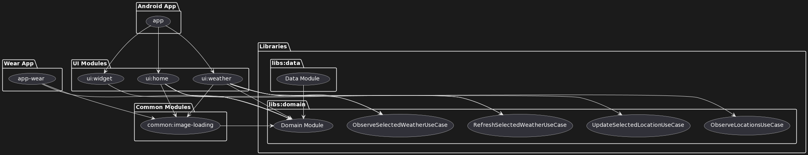
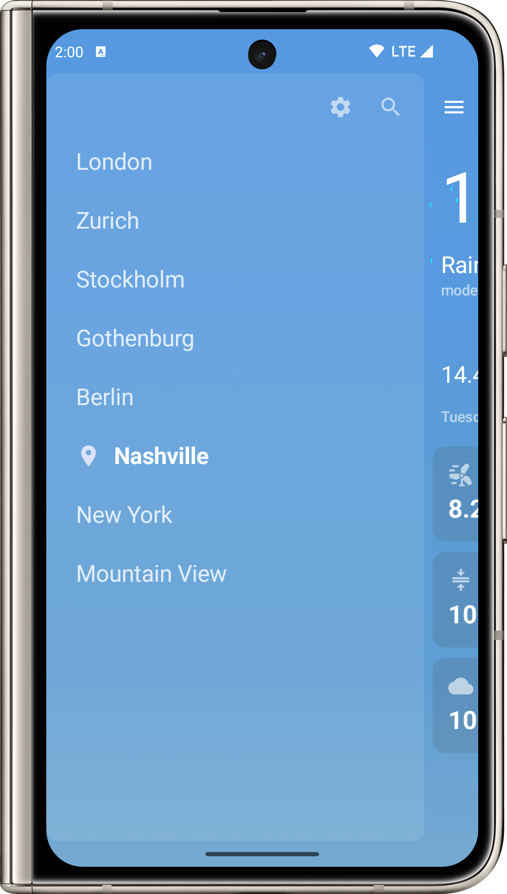
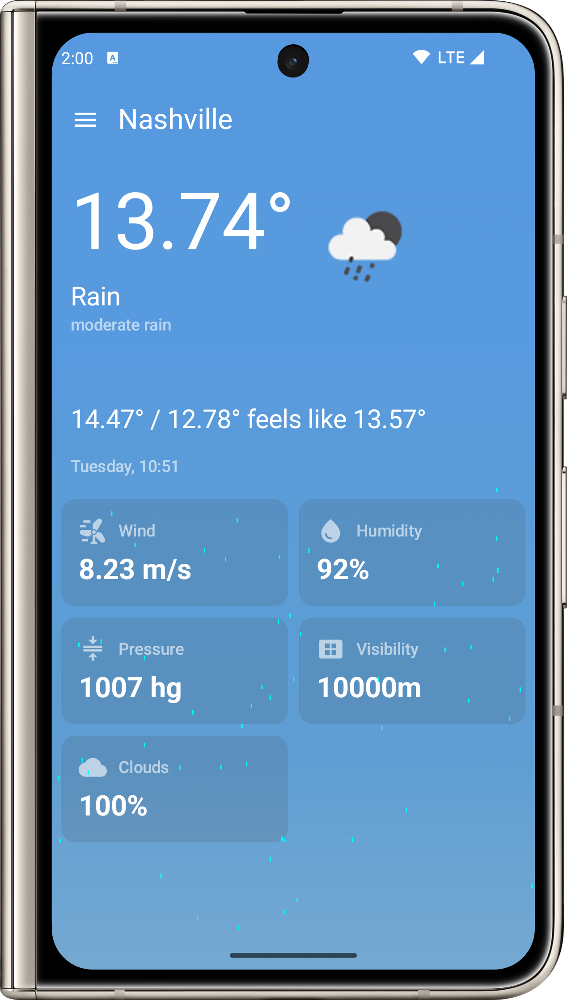
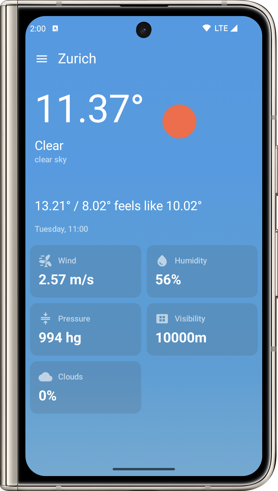
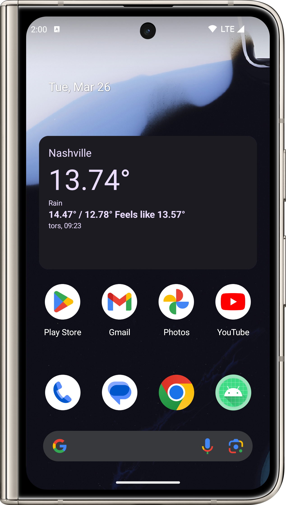
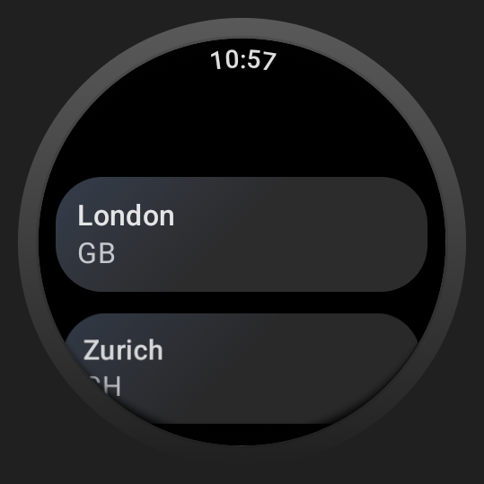
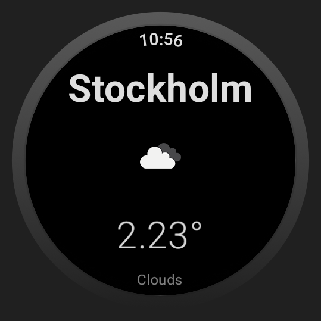

# Vilket Väder - Weather App for Android and Wear Devices

## Introduction

"Vilket Väder" is a Kotlin-based weather application for Android mobile and wearable devices. It presents the current weather conditions for selected cities using the OpenWeatherMap API, with a design that prioritizes modularity, maintainability, and clean architecture. The application is structured to support both Android phones and Wear OS devices, utilizing the Unidirectional Data Flow (UDF) pattern.

## Project Structure

The application is divided into several modules:

- **app**: The Android phone app module.
- **app-wear**: The module for the Wear OS app.
- **common**: Holds common code like image loading, screens, and testing utilities.
  - `image-loading`: Shared image loading logic.
  - `screens`: Shared UI components.
  - `testing`: Shared testing utilities.
- **libs**:
  - `data`: Handles data retrieval, persistence, and caching.
  - `domain`: Contains business logic and use cases.
- **ui**: Feature modules for UI.
  - `home`: The home feature module.
  - `weather`: The weather feature module.
  - `widget`: The widget feature module for Android home screen widgets.

Each UI feature module depends on the `domain` module to interact with use cases. The `data` module relies on `domain` for dependencies and includes networking logic. The `common` modules are used across all feature modules.

## Module Structure Diagram



## Technologies

- **Jetpack Compose**: For building native Android UI.
- **Jetpack Compose for Wear OS (Glance)**: To create custom wearable user interfaces.
- **Ktor**: For performing network operations.
- **Room Database**: For local storage and caching.
- **OpenWeatherMap API**: As the source for weather data.
- **Slack's Circuit**: For implementing UDF architecture and managing navigation.
- **Kotlinx Serialization**: For handling JSON deserialization from API responses.
- **Kotlinx DateTime**: For dealing with date and time operations.
- **Dagger Hilt**: For dependency injection.
- **Unit and Instrumented Tests**: To ensure code reliability.
- **End-to-End and Screenshot Tests**: Using Roborazzi for visual test validation.
- **Gradle Doctor**: For enhancing gradle builds.
- **Spotless and Detekt**: For code linting and ensuring adherence to coding standards.
- **Kotlin Version Catalogs**: For managing the dependencies in a type-safe manner.
- **Gradle Convention Plugins**: To share build logic across different modules.
- **Coil**: For image loading and caching.

## Installation

1. Clone the repository:
   ```
   git clone https://github.com/LloydBlv/VilketVader.git
   ```
2. Navigate to the project directory:
   ```
   cd Vilket-Vader
   ```
3. Build the project using Android Studio or via the command line:
   ```
   ./gradlew assembleDebug
   ```

## Screenshots

Below are some screenshots of the application, grouped by device type and feature:

### Mobile App Screenshots

| Weather Locations | Raining Animation | Weather Details | Widget View |
| --- | --- | --- | --- |
|  |  |  |  |

### Wear OS App Screenshots

| Weather Locations | Weather Details |
| --- | --- |
|  |  |

## Videoshots

Video previews provide a glimpse into the application's features. Click on the placeholders to watch the videos.

### Mobile App Videoshot

[](screenshots/mobile_videoshot.gif)

### Wear OS App Videoshot

[](screenshots/wear_videoshot.gif)

### Widget Videoshot

[](screenshots/widget_videoshot.gif)

